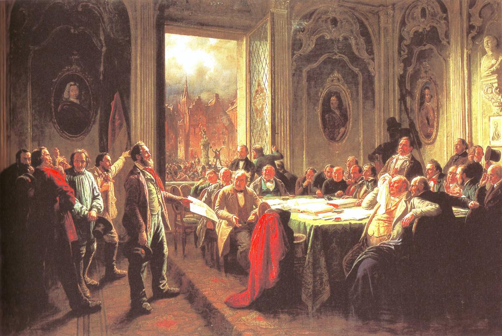

<h1 style="position:absolute;left:-9999px;width:1px;height:1px;overflow:hidden;">
  Nicolás Izquierdo, Political Science, Political Scientist, Political Economy
</h1>

<figure style="margin:0;">
  
  <figcaption style="font-size:0.9em;margin-top:-13px;margin-bottom:20px;">
    
      Workers’ Delegation Before the Magistrate
    by Johann Peter Hasenclever
  </figcaption>
</figure>

Welcome! My name is Nicolás Izquierdo and I am a Master's student in Social Sciences at the
<a href="https://ic3jm.es/en/postgraduates/master-degree-social-sciences/">Carlos III–Juan March Institute (IC3JM)</a>.
I also hold both degrees in
<a href="https://www.uc3m.es/bachelor-degree/law">Law (LL.B.)</a>
and
<a href="https://www.uc3m.es/bachelor-degree/political-science">Political Science (B.A.)</a>
from the University Carlos III of Madrid.

My research interests lie in comparative political economy and labor politics, encompassing issues of political representation, contentious politics, and redistribution. I am particularly interested in how labor mobilization shapes policy outcomes and mass preferences across advanced democracies. I also study courts and legal processes, focusing on how private economic interests influence judicial decision-making.

Outside academia, I enjoy social and political cinema and
<a href="https://www.chess.com/member/nicolas_izq">playing chess</a>.

You can find my full CV <a href="/CV-nicolas-izquierdo-11-25.pdf">here</a>.

