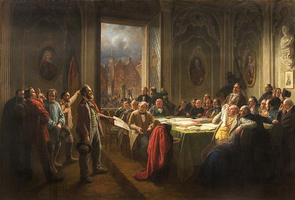

<h1 style="
  position:absolute;
  left:-9999px;
  top:auto;
  width:1px;
  height:1px;
  overflow:hidden;
">
  Nicolás Izquierdo
</h1>

<figure style="margin:0;">
  
  <figcaption style="font-size:0.9em; margin:-20; padding-top:-40px; padding-bottom:20px;">
    <a href="/marx-anecdote.html#anecdote" target="_blank"><em>Worker’s Delegation Before the Magistrate</em></a> 
    by Johann Peter Hasenclever
  </figcaption>
</figure>

Welcome! Ny name is Nicolás Izquierdo and I am a Master's student in Social Sciences at the [Carlos III–Juan March Institute (IC3JM)](https://ic3jm.es/en/postgraduates/master-degree-social-sciences/). I also hold both a degree in [Law (LL.B.)](https://www.uc3m.es/bachelor-degree/law-political-science) and a degree in [Political Science (B.A.)](https://www.uc3m.es/bachelor-degree/law-political-science) from the University Carlos III of Madrid.  

My research interests lie in the intersection of comparative political economy and historical political economy, with a particular focus on how economic interests shape political institutions and policy outcomes in democratic regimes. I am especially interested in the political economy of democratic class conflict — how the competing interests of unions, firms, and the state shape institutional design, patterns of representation, and distributive outcomes. 

