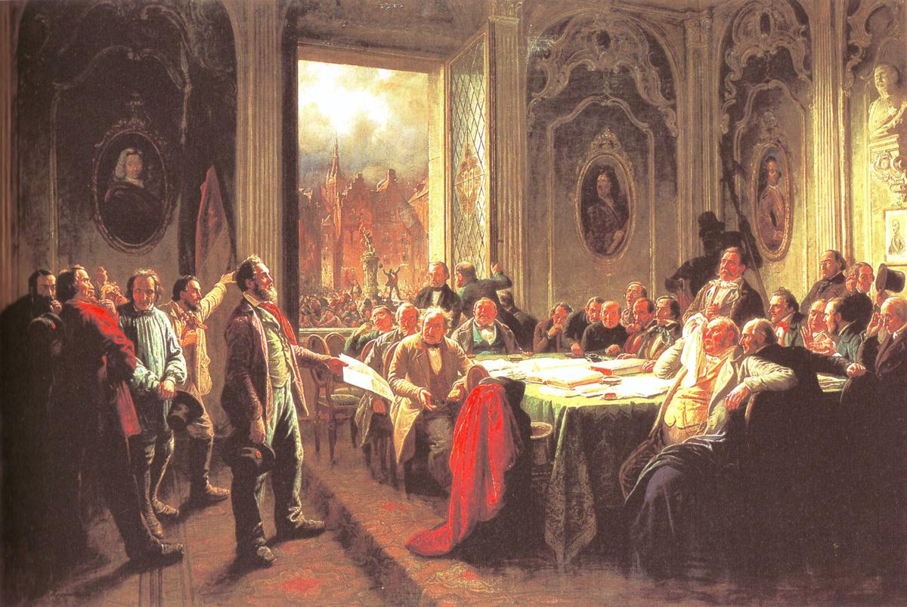

<h1 style="position:absolute;left:-9999px;width:1px;height:1px;overflow:hidden;">
  Nicolás Izquierdo, Political Science, Political Scientist, Political Economy, Labor Politics
</h1>

<figure style="margin:0;">
  
  <figcaption style="font-size:0.9em;margin-top:-13px;margin-bottom:20px;">
    
      Workers’ Delegation Before the Magistrate
    by Johann Peter Hasenclever
  </figcaption>
</figure>

  Welcome! I am a Master's student in Social Sciences at the
  <a href="https://ijlinz.es/en/postgraduates/master-degree-social-sciences/sc-plan/">Juan Linz Institute (IJL)</a>
  (formerly the <a href="https://en.wikipedia.org/wiki/Instituto_Carlos_III-Juan_March">Carlos III–Juan March Institute</a>).
  I also hold both degrees in
  <a href="https://www.uc3m.es/bachelor-degree/law">Law (LL.B.)</a>
  and
  <a href="https://www.uc3m.es/bachelor-degree/political-science">Political Science (B.A.)</a>
  from the University Carlos III of Madrid.

  My research interests lie in comparative political economy and labor politics, encompassing issues of political representation, contentious politics, and redistribution. Specifically, I am interested in how labor mobilization shapes policy outcomes and mass preferences across advanced democracies. 

  Outside academia, I enjoy playing chess (you can challenge me <a href="https://www.chess.com/member/izq_nicolas" target="_blank" rel="noopener noreferrer">here</a>!).

  You can download my full CV <a href="/cv_NI.pdf">here</a>.

</script>
